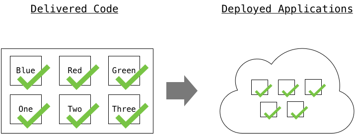
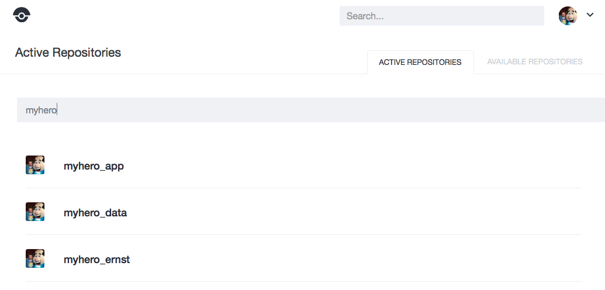
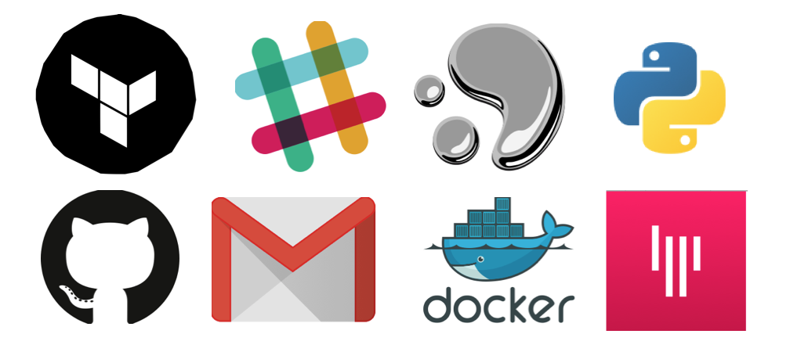

[item]: # (slide)


# Module: CICD

Continuous Integration Continous Delivery

[item]: # (/slide)

## Abstract

CICD... just one of so many new buzz words we've been exposed to over the last few years.  For many of us we hear the letters, know what they stand for, and can shout "Jenkins" faster than a feather falls, but what does it really mean?  In the session we will dive into CICD and come out with a detailed understanding of what happens in a "Code Pipeline".  This will happen primarily through a guided, hands on lab where each participant will build and deploy an application service with CICD.

[item]: # (slide)
# Main Topics

* [Simplified Software Development Process](#simplified-software-development-process)
* [CICD](#cicd)
* [CICD Tools](#cicd-tools)
* [Using Drone as a Build Server](#using-drone-as-a-build-server)
* [Links](#links)
* [Why do we care...](#why-do-we-care)
* [Go Do It Exercises](#go-do-it-exercises)

[item]: # (/slide)

[item]: # (slide)

# Simplified Software Development Process

[item]: # (/slide)

[item]: # (slide)

## Integration


[item]: # (/slide)

Development projects consists of many developers, all working on individual features and code.  Eventually the individual work needs to be brought together and combined into a single code base.  Individual developers will be (should be) testing their code as they work.  Once integrated, tests can be run verfiying that the code works as designed and expected.  

[item]: # (slide)

## Delivery


[item]: # (/slide)

Once the code has been successfully integrated and tested, it needs to be packaged and made available for review, inspection and use.  This step typically includes the creation of binaries, containers, or other methods of packaging of completed code for efficient transport and delivery.  The output of this packaging are generically refered to as *Artifacts*.  These artifacts are then stored in an ***Artifact Repository***.  

Common Artifact Repostories include: 

* Container Registries 
    * ie Docker Hub
* Object Storage
    * AWS S3
* FTP Servers
* Code Specific Repositories 
    * ie PyPi

[item]: # (slide)

## Deployment



[item]: # (/slide)

Once new code has been packaged and delivered to the appropriate repository, it needs to be deployed so that users can take advantage of the new features or bug fixes.  

[item]: # (slide)

## CICD 
### ( or CICDCD)

* **Continuous Integration**: Merging of development work with code base constantly so that automated testing can catch problems early
* **Continuous Delivery**: Software package delivery mechanism for releasing code to staging for review and inspection
* **Continous Deployment**: Relies on CI and CD to automatically release code into production as soon as it is ready. Constant flow of new features into production
 

[item]: # (/slide)

[item]: # (slide)

## CICD Process Flow


[item]: # (/slide)

[item]: # (slide)

## DevOps and CICD


[item]: # (/slide)

DevOps is all about automation and optimizing the software development and delivery process.  From the beginning of the DevOps movement, developers looked for methods to automate the code pipeline, and those efforts resulted in the creation of many tools, utilities, scripts, and methodologies to achieve true CICD.  

[item]: # (slide)

# CICD Tools

[item]: # (/slide)

[item]: # (slide)

## Hudson and Jenkins


[hudson-ci.org](http://hudson-ci.org)

[jenkins.io](https://jenkins.io)

[item]: # (/slide)

Hudson was sort of the grandfather of CI/CD tools, but was eventually forked into what became known as Jenkins.  Jenkins is today the most extensible CI/CD tool that is available, and offers over a thousand plugins for variousintegrations such as SCM's, IaaS, PaaS providers, etc. 

The basic architecture of Jenkins consists of Master and slave nodes, slave nodes can be added for additionally scalability for processing more jobs concurrently, as well as supporting multiple platforms / architectures. Jenkins is configured primarily through a UI where plugins, jobs, and schedules are managed centrally.  Based on the success of Jenkins, other offerings were introduced which followed similar workflow and architecture, these include Bamboo, Team City and others.

[item]: # (slide)

## New "2nd Gen" CICD Tools 


[item]: # (/slide)

While Jenkins is still widely used in many development shops, new competitors have emerged which change the paradigm for how we think about CI/CD.  These include Travis, CircleCI, and Drone to name a few.  The primary difference between these products and their predecessors is where the configuration for the build pipeline resides.  As mentioned previously Jenkins, Bamboo, and others relied on a seperate configuration which resided on the build server itself, whereas Drone, Travis, and CircleCI leverages a build configuration file which resides with the source code itself, and is therefore version controlled.

[item]: # (slide)

# Using Drone as a Build Server


[item]: # (/slide)

There are many options for Build Servers and CICD tools available.  As with any piece of software, every tool works a little differently, but the concepts are all the same.  Here we will be looking at [Drone.io](http://drone.io) as an example CICD platform that we can use.  

Drone is written in Go, and has been built with microservices and containers in mind.  Drone itself operates as a Docker container, and performs every task inside isolated docker containers making it ideal for using a single server that builds many different projects.  

[item]: # (slide)

# Drone Concepts and Terms 

[item]: # (/slide)

[item]: # (slide)

## Remote Driver


[item]: # (/slide)

Drone is tightly integrated with the code repo (ie GitHub) and requires one be identified as the Remote Driver.  The code repository provides the user authentication for Drone, as well as the source for all builds.  

[item]: # (slide)

## Repositories 



[item]: # (/slide)

Every repostitory in the underlying code repo is visible to a Drone user as "Available Repositories".  Repositories are "Activated" by a user to indicate that Drone should monitor and act on instructions contained.  

[item]: # (slide)

## Plug-Ins 



[item]: # (/slide)

Drone is a module architecture with every aspect of the build done independently by a _plug-in_.  Exmamples of plug-in tasks are: 

* Publish a Docker Container 
* Send a notification to Spark
* Interact with a Git Repo 
* Interact with AWS, Azure, etc 

There are "official plug-ins" and community created plug-ins available.  

[item]: # (slide)

## Build Phases

* Build (Integrate)
* Publish (Delivery)
* Deploy (Deploy)
* Notify

[item]: # (/slide)

Drone has 4 main build phases that are leveraged.  Other phases and steps are available, but these four main ones are enough to get started.  

### Build

Think of this as the "Integration" part of CICD.  In the Build phase you will perform any testing and binary creation/compilation needed.  

### Publish

Think of this as the "Delivery" part of CICD.  In the Publish phase you would make the artifacts from the Build phase available for use.  A common example would be creating a docker container and pushing it to a registry.  

### Deploy 

Think of this as the "Deployment" part of CICD.  In the Deploy phase, you would create/update an environment with the newly Published code.  

### Notify

This is a final phase that is commonly used to update any one/thing that needs to be informed following a build.  This could be a notification to a person, or a forward notification to another system in a multi-tool CICD chain.  

[item]: # (slide)

## .drone.yml 

#### Example
```
build:
  run_tests:
    image: python:2-alpine
    commands:
      - python testing.py

publish:
  docker:
    repo: $$DOCKER_USERNAME/$$DOCKER_REPO
    tag: latest

deploy:
  webhook:
    image: plugins/drone-webhook
    urls:
      - https://$$MARATHON/marathon/v2/apps/$$APPNAME/restart
```

[item]: # (/slide)

Drone leverages a file called `.drone.yml` in the repository root to describe the build process.  This is a yaml formated file that describes the Build phases, plug-ins used, etc.  

[item]: # (slide)

## .drone.sec 
#### Example
```
cat drone-secrets.yml

environment:
  # Your Docker account information to publish the container
  DOCKER_USERNAME: johnsmith
  DOCKER_PASSWORD: HowSecure1901
  DOCKER_EMAIL: john.smith@domain.intra
  SPARK_TOKEN: akssdfAFasdfkjaSDFAsdfkasfdaSDFasdf
  SPARK_ROOM: Y2lzYakssdfAFasdfkjaSDFAsdfkasfdaSDFasdf

drone secure --repo jsmith/app --in drone-secrets.yml

cat .drone.sec

RJdYPeEDRoKSBk5iW8BInMorBatA40I6ZfKqlPj4yWOHfRVdUntS0Uf6OhMszCyenHQEqntUAOeLYg.SegQH26g7wefYp9J.9ON1xGeH-KaVIzIYkgZLDwx0so_SrcKjWCbh3F5oeksNGIrZ2gcsFY3T79PF_SMhvX2OuRoz3S3rT6qKPiBf1PSr3ttlyITug4003QR3bDDK-7QaVJ-dmycV5tnd4dFSflRrmchlaNQ541-SX7Q9DFR1-meeVCMme9an57JtdrW2uLC4FvHRxmmeSIE

```

[item]: # (/slide)

Drone will be interacting with external systems on behalf of the user, and to do so needs usernames, account ids, passwords, etc to be available.  These can be provided in clear text within the .drone.yml file, but that is a major security risk.  To provide secret management, drone can encrypt secrets into a file called `.drone.sec` that can be safely commited to a repository.  

[item]: # (slide)

# Experiments 

To gain an understanding of using Drone, we will leverage the lab at: [imapex-training/cicd\_learning\_lab](https://github.com/imapex-training/cicd_learning_lab/blob/master/README.md)

[item]: # (/slide)

[item]: # (slide)

## Links 

* [hudson-ci.org](http://hudson-ci.org)
* [jenkins.io](https://jenkins.io)
* [https://technologyconversations.com/2016/01/14/the-short-history-of-cicd-tools/](https://technologyconversations.com/2016/01/14/the-short-history-of-cicd-tools/)
* [http://www.slideshare.net/Robert_McDermott/anatomy-of-a-continuous-integration-and-delivery-cicd-pipeline](http://www.slideshare.net/Robert_McDermott/anatomy-of-a-continuous-integration-and-delivery-cicd-pipeline)
* [Drone Usage](http://readme.drone.io/usage/overview/) 
* [Drone Plugins](http://readme.drone.io/plugins/) 
* Example .drone.yml files for actual projects 
	* [myhero_app](https://github.com/hpreston/myhero_app/blob/master/.drone.yml) 


[item]: # (/slide)

[item]: # (slide)

# Why do we care 

[item]: # (/slide)

Modern application development is all about automation.  Manual build, test, and publish are rapidly being replaced by CICD tools and processes.  We need to understand, but also have a practical hands on knowledge to truly talk this topic other developers.  

Also, there is the practical reason that we will be building demo apps, and having the ability to use CICD for each demo will make our time usage the most optimal.  

[item]: # (slide)

## Go do it exercises 

Continue working on the demoapp used in the experiments section and take the following actions.  

* Add support for branches by tagging the docker containers differently
	* tag each container with the name of the branch
	* If the branch is "master", also tag it as "latest"
* Publish your containers to quay.io in addition to hub.docker.com 


[item]: # (/slide)


